# Replay — Administrator Guide

This guide walks an administrator through everything you need to run a Replay deployment: first-time setup, day-to-day match management, live streaming, performance tuning, users, and branding.

## Contents

1. [Quick start checklist](#quick-start-checklist)
2. [Roles and access](#roles-and-access)
3. [First-time setup](#first-time-setup)
4. [The admin dashboard](#the-admin-dashboard)
5. [Managing matches](#managing-matches)
6. [Uploading video](#uploading-video)
7. [Live streaming](#live-streaming)
8. [Performance tuning](#performance-tuning)
9. [Users and roles](#users-and-roles)
10. [Branding and labels](#branding-and-labels)
11. [Backups and data export](#backups-and-data-export)
12. [Reference](#reference)

---

## Quick start checklist

For a brand-new install, work through these in order:

- [ ] Copy `.env.example` to `.env.local` and set `ADMIN_USER` + `ADMIN_PASS`.
- [ ] Choose a data directory and set `REPLAY_DATA_DIR` to it.
- [ ] Start the server (`python server.py` or `docker compose up`).
- [ ] Sign in at `/admin/overview` with the env-var admin account.
- [ ] Visit `/admin/settings` and update the team name, season title, and intro copy.
- [ ] Upload a club logo and favicon under **Branding**.
- [ ] Visit `/admin/users` and create accounts for everyone who needs to upload matches.
- [ ] (Optional) Visit `/admin/live` to enable streaming and rotate the stream key.
- [ ] (Optional) Visit `/admin/performance` to confirm hardware acceleration is detected.

---

## Roles and access

Replay has four distinct roles:

| Role | Can do |
|---|---|
| **Anonymous** | Browse the season grid, watch matches, watch live |
| **Viewer** | Same as anonymous; intended for future read-only features |
| **Uploader** | Add / edit / delete matches and upload video. Limited to `/admin/matches` |
| **Admin** | Everything: users, live, settings, performance tuning |

There is also one special account: the **environment-variable superadmin**. This is the user you set via `ADMIN_USER` and `ADMIN_PASS` in `.env.local`. It is always treated as an admin, exists outside the user database, and cannot be disabled or deleted from the UI. Use it as a recovery account — if you ever lose access through the UI, you can sign in with the env-var credentials and fix the database account.

> **Warning:** Don't reuse the `ADMIN_USER` name as a database account. The env-var account is checked first; a same-named DB user will be ignored.

---

## First-time setup

### Environment configuration

Replay reads its critical configuration from `.env.local` at the project root. Copy `.env.example` to `.env.local` and edit:

```bash
ADMIN_USER=admin
ADMIN_PASS=change-me-to-something-strong
REPLAY_PORT=8090
REPLAY_DATA_DIR=/data
```

> **Warning:** The server **refuses to start** if `ADMIN_PASS` is unset. This is intentional — without it, the recovery account would have no password.

### Authentication limits

Two security-related variables are worth knowing about:

| Variable | Default | What it does |
|---|---|---|
| `MAX_ACTIVE_TOKENS` | `1000` | Hard cap on the number of concurrent admin/uploader sessions held in memory. When the cap is hit, the oldest token is evicted. Raise it only if you genuinely have hundreds of admins logged in at once. |
| `ALLOWED_ORIGINS` | (empty) | Comma-separated list of hostnames allowed to call `/api/login`. Set it once you know the public hostname so the login endpoint refuses cross-origin requests. |

Login itself is rate-limited to 5 attempts per 60 seconds per IP regardless of these settings.

For the full list of environment variables — including storage tiering, log format, and reverse-proxy hints — see [`docs/DEPLOYMENT.md`](DEPLOYMENT.md).

### Data directory layout

Replay stores everything under `REPLAY_DATA_DIR`:

```
$REPLAY_DATA_DIR/
├── replay.db            # SQLite database (matches, users, settings)
├── videos/              # Per-match folders with HLS variants and team logos
└── app_assets/          # Logo, favicon, and other branding uploads
```

For larger deployments, you can split hot HLS data and cold raw uploads onto separate volumes by also setting `REPLAY_ORIGINALS_DIR` — see [`docs/DEPLOYMENT.md`](DEPLOYMENT.md) for details.

### First sign-in

1. Open `http://localhost:8090` in a browser.
2. Click **LOGIN** in the top-right.

   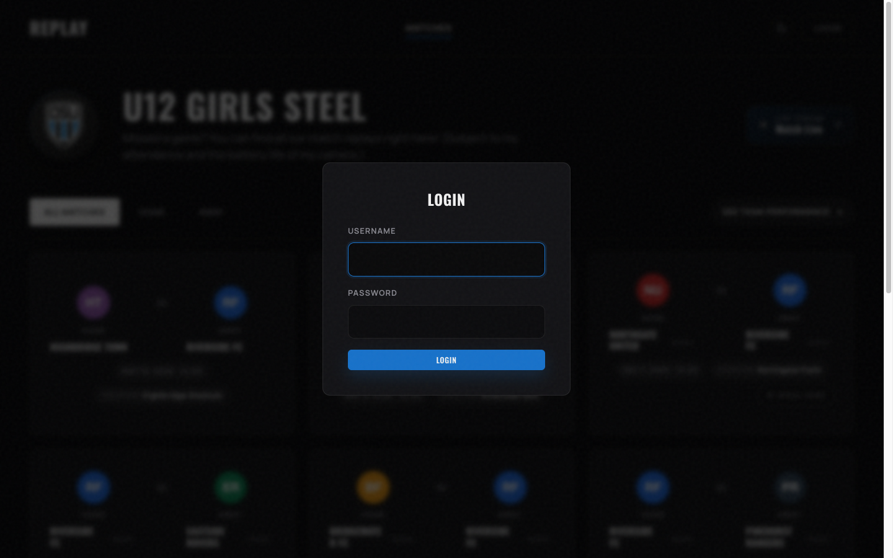

3. Enter the `ADMIN_USER` / `ADMIN_PASS` you set in `.env.local`.
4. Once signed in, an **ADMIN** link appears in the top nav. Click it to enter the admin dashboard.

---

## The admin dashboard

`/admin/overview` is your starting point. The status strip at the top shows live counts of disk usage, viewers, ongoing transcodes, errors, and total matches. The KPI tiles below repeat that at a glance, and the Recent Activity feed lists every logical event that has happened on the system.

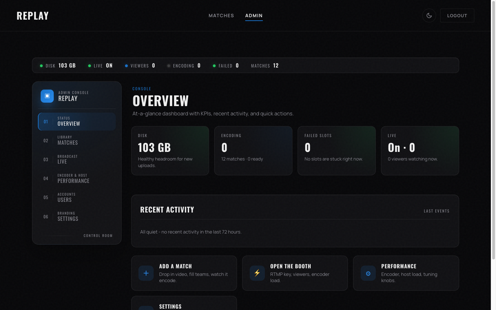

The left sidebar has six sections:

| Section | Purpose |
|---|---|
| **Overview** | KPIs and recent activity (this page) |
| **Matches** | Match library — add, edit, delete, recover failed transcodes |
| **Live** | RTMP cockpit — stream key, viewers, encoder load |
| **Performance** | Tuning knobs and disk diagnostics |
| **Users** | User account management |
| **Settings** | Branding, navigation labels, feature toggles |

> **Note:** Old links to `/admin/streams` redirect to `/admin/live`, and `/admin/system` redirects to `/admin/performance`.

---

## Managing matches

The Matches tab is a **library**, not an editor — it shows every match in the system as a row with format, per-slot status, score, and date.

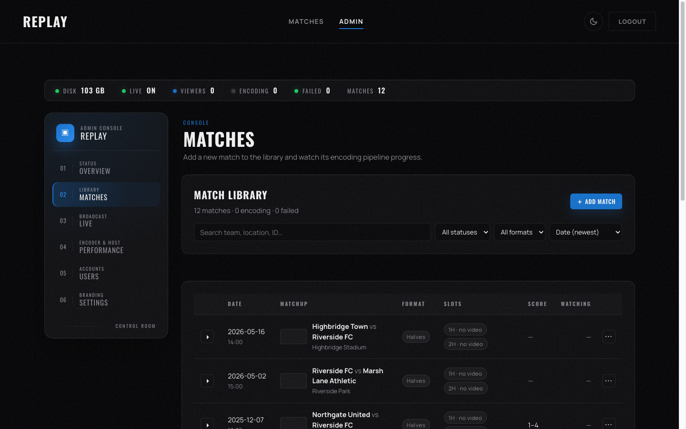

### Adding a match

1. Click **+ Add Match** in the top-right of the table.
2. The Add Match modal opens.

   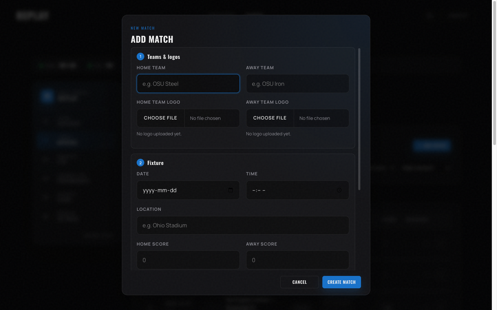

3. Fill in:
   - **Home / Away team** — required.
   - **Logos** — optional. Accepted formats: PNG, JPG, SVG, WebP (max 20 MB). SVG uploads are sanitized — script tags are stripped.
   - **Date** and **Time** — required.
   - **Location** — optional but recommended.
   - **Format** — choose **Full match** (one video for the whole game) or **Two halves separate videos** (first half + second half).
   - **Scores** — leave blank for upcoming matches; fill them in after the match is over.
4. Click **CREATE MATCH**. The match appears in the table immediately. You can upload the video files now or come back later.

### Editing a match

1. Click the **⋯** menu next to any match row.
2. Choose **Edit details**.
3. The same modal opens, prefilled with the current values.

   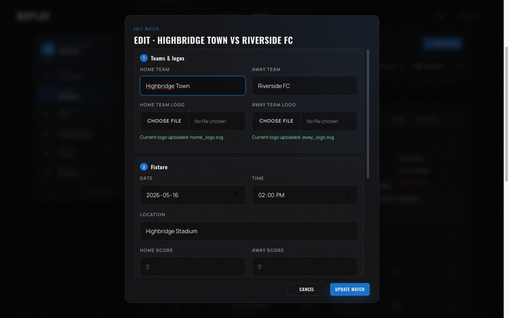

4. Make your changes and click **UPDATE MATCH**.

> **Tip:** The match URL is built from the team names and date (a "slug"). Editing those fields will change the URL. Old links keep working only as long as nobody points them at the new slug.

### Per-slot diagnostics

Click the **▸** button on any row to expand it. The expanded row shows a card per video slot (Full / 1st / 2nd) with status, asset checks, and recovery actions.

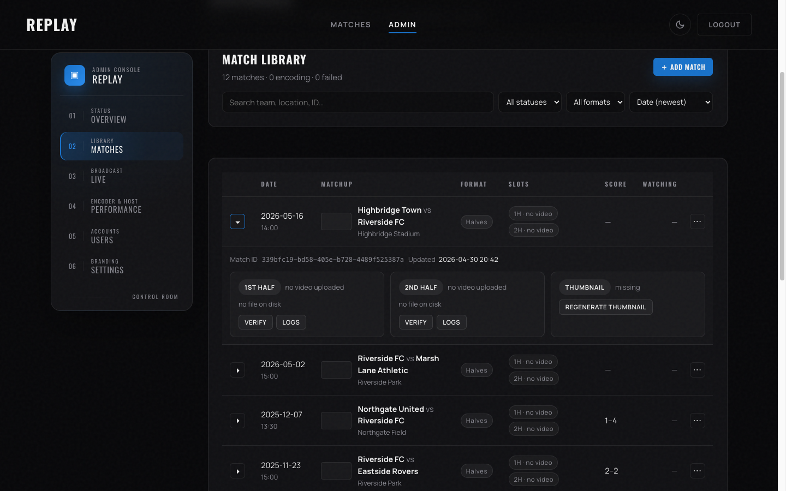

The actions you'll see for each slot:

| Action | What it does |
|---|---|
| **Verify** | Checks that the MP4, HLS playlist, and segments exist on disk |
| **Regen HLS** | Rebuilds the HLS variants from the existing MP4 (no re-transcode) |
| **Re-transcode** | Re-runs the full transcode from the original raw upload |
| **Force Re-transcode** | Same as above but ignores the "already done" guard |
| **Logs** | Opens the error log for this slot |
| **Regenerate Thumbnail** | Re-extracts the still image from the video |

Use **Regen HLS** as your first recovery step — it's fast and fixes most "playback fails" issues without re-encoding.

### Deleting a match

In the **⋯** menu, choose **Delete match**. This is permanent — the row, the videos, and the HLS variants are all removed.

> **Warning:** There is no undo. If you might want the videos back, copy the match folder out of `videos/` first.

---

## Uploading video

Replay handles large match recordings (often 5–15 GB) via **resumable chunked uploads**: the file is split into pieces, each piece is uploaded with a session token, and the upload survives a network drop or browser refresh.

### How the upload flow works

1. Open the **Edit details** modal for a match (or the Add Match modal — uploads work in both).
2. Scroll down to the **Videos** section.

   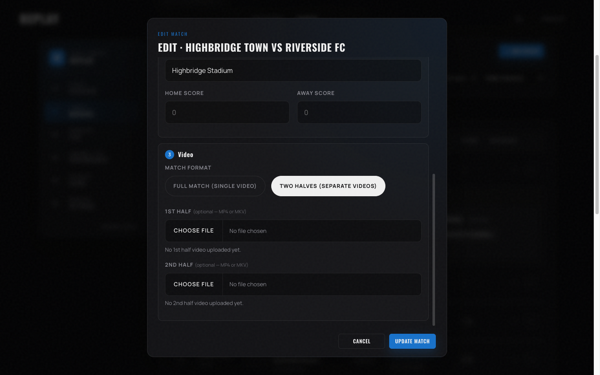

3. Click **CHOOSE FILE** under the slot you're filling — full match, first half, or second half.
4. Pick the file. Upload starts immediately and a progress bar appears.
5. Once the upload finishes, Replay queues the file for **transcoding**:
   - The original is preserved as `<slot>_raw.<ext>`.
   - ffmpeg produces an `<slot>.mp4` for direct download (if downloads are enabled).
   - ffmpeg also produces HLS variants (1080p / 720p / 480p ladder by default) for adaptive streaming.
   - A thumbnail is extracted automatically.
6. The library row's status pill changes from **PROCESSING** to **READY** when the slot is fully transcoded.

> **Note:** Transcoding speed depends on your hardware acceleration setting. With NVENC or VAAPI, expect roughly real-time speed; CPU-only is much slower. The Performance tab shows current jobs.

### Recovering from a failed upload or transcode

- If the upload itself failed mid-flight, just choose the same file again. Replay detects the partial chunks via the file's first-chunk hash and resumes from where it left off.
- If transcoding failed, expand the row and click **Logs** to see the ffmpeg error, then **Re-transcode** to retry.
- For "video plays in some browsers but not others," try **Regen HLS** — it's almost always an HLS issue, not a transcoding issue.

> **Warning:** Don't restart the server during a long transcode unless you have to. Pending transcodes do resume on startup, but a force-killed ffmpeg can leave a partial output that needs **Force Re-transcode** to recover.

---

## Live streaming

The Live page is the cockpit for broadcasting matches in real time. The left rail is the ingest config; the right rail shows live throughput, encoder load, and active viewers.

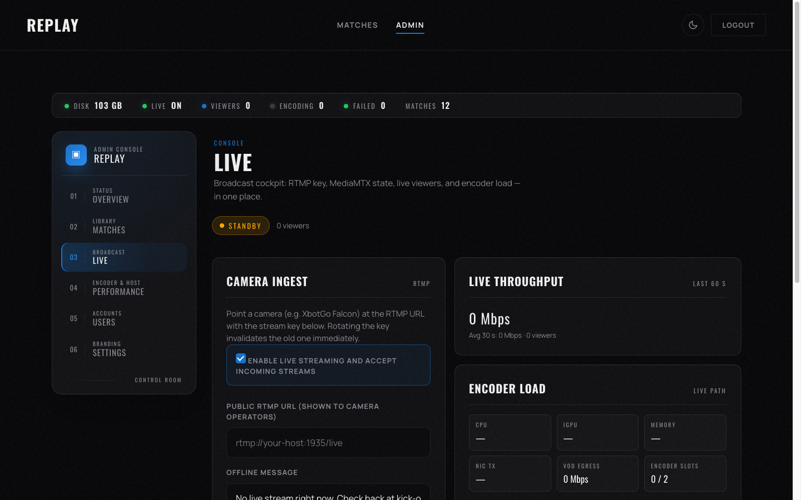

### Prerequisites

Live streaming requires the **MediaMTX sidecar**. The bare `python server.py` start does **not** include it. To get a working live setup, run:

```bash
docker compose up --build
```

That spins up three services on the same network: the FastAPI app, MediaMTX (the RTMP receiver and HLS distributor), and Caddy (the reverse proxy).

> **Note:** If a viewer hits `/live` while no stream is active, they'll see a **"No live stream right now"** message. That's the expected offline state — we screenshot it in the [user guide](./user-guide.md#watching-live).

### Securing the publish webhook

When a camera connects, MediaMTX calls Replay's `/api/live/auth` endpoint to validate the stream key. That call is protected by a **shared secret** so no one outside your Docker network can spoof an "approved publisher" response.

| Variable | Default | What it does |
|---|---|---|
| `LIVE_AUTH_SECRET` | (empty) | Shared secret MediaMTX sends in the `X-Internal-Secret` header. Configure the same value in `mediamtx.yml`'s `authHTTPHeaders`. |
| `LIVE_AUTH_ALLOW_INSECURE` | `0` | Escape hatch that lets the webhook accept unauthenticated calls when `LIVE_AUTH_SECRET` is unset. |

The endpoint **fails closed**: if `LIVE_AUTH_SECRET` is unset, every publish attempt returns 503. This is the correct default — an unsecured webhook means anyone who can reach the endpoint can claim to be MediaMTX and publish a fake stream.

> **Warning:** `LIVE_AUTH_ALLOW_INSECURE=1` is for local development only. It bypasses the fail-closed gate and is logged with a warning the first time it fires. Never enable it in production, on a Tailscale-exposed host, or anywhere MediaMTX is reachable from the public internet.

To set up a real secret:

1. Generate a random value (`openssl rand -hex 32`) and put it in `.env.local` as `LIVE_AUTH_SECRET=...`.
2. Edit `mediamtx.yml` and set the same value under `authHTTPHeaders` so MediaMTX sends it on every webhook call.
3. Restart the stack (`docker compose restart`).

After that, `/api/live/auth` accepts only requests carrying the matching `X-Internal-Secret` header — every other request gets a 401.

### Setting up a stream

1. On the Live page, scroll to the **Endpoint & Key** section.

   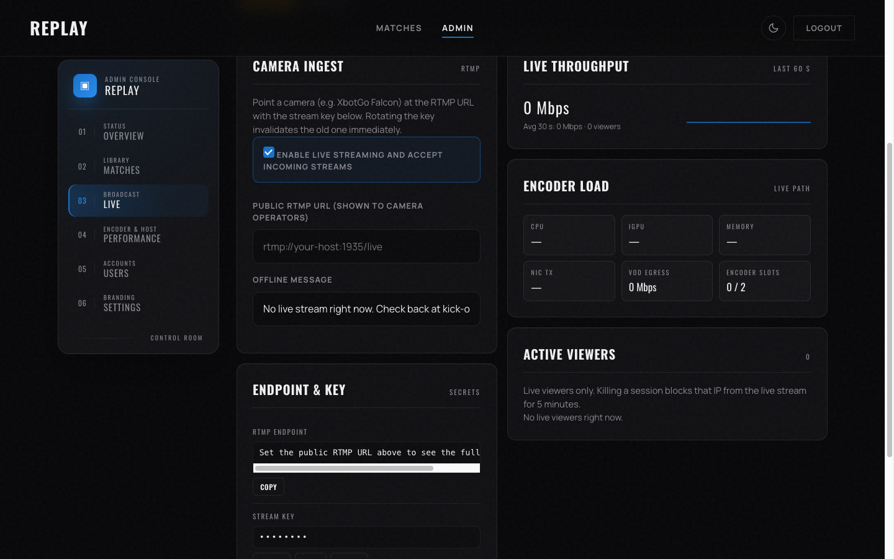

2. Click **REVEAL** to see the current stream key. This key is private — never paste it in chat, screenshots, or commit messages.
3. Click **ROTATE** if the current key has been exposed or if you simply want a fresh one. The old key stops working immediately.
4. In your camera or encoder app (OBS, Wirecast, the Mevo iOS app, etc.), set:
   - **Server**: the `Public RTMP URL` shown in the panel.
   - **Stream key**: the value you copied or revealed.
5. Start broadcasting from the camera.
6. The Live page's status pill flips from **STANDBY** to **ON AIR**. Active viewers appear in the right rail. The throughput sparkline shows incoming bandwidth.

### Going off-air

Stop the camera. The page detects that no new HLS segment has arrived for `LIVE_STALE_SEGMENT_AGE_SECONDS` (default 90 seconds) and flips back to **STANDBY**. Viewers see the offline message.

### Toggling live streaming on or off site-wide

In **Settings**, the **Enable Live Streaming** checkbox controls whether the **Watch Live** link appears in the public navigation. Turn it off when the season is over.

---

## Performance tuning

The Performance tab is your "how is the server holding up?" view. The top card shows host signals (CPU, memory, GPU, throughput, transcode realtime factor, disk headroom).

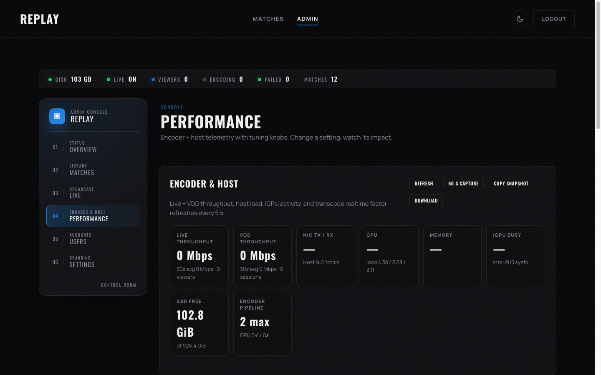

### What to watch

| Tile | Healthy range | What it means |
|---|---|---|
| **Throughput** | Below your uplink budget | Total live + VOD HLS bandwidth leaving the server |
| **Active viewers** | — | Live + VOD HLS sessions right now |
| **Encoder load** | Below the configured concurrency | How many transcodes are in flight |
| **Disk headroom** | At least the `min_free_disk_bytes` setting | Free bytes on the videos volume |
| **Realtime factor** | ≥ 1.0× (preferably 2–4×) | How much faster than realtime ffmpeg is encoding |

### The Tuning Knobs card

Below the host signals, the Tuning Knobs card lets you adjust live values without restarting the server. The most common knobs:

| Knob | What it does |
|---|---|
| `transcode_concurrency` | How many matches transcode in parallel (1–8) |
| `replay_hwaccel` | Hardware encoder: `auto`, `nvenc`, `vaapi`, `qsv`, or `cpu` |
| `hls_segment_duration` | Segment length in seconds (2–10). Lower = lower latency, more overhead. New transcodes only |
| `min_free_disk_bytes` | Refuse new uploads if free space drops below this |
| `upload_disk_headroom_multiplier` | Required free space = upload size × this (default 2.2) |
| `max_upload_size_bytes` | Hard cap on a single video file |
| `hls_variant_presets` | The ABR ladder (defaults: 1080p / 720p / 480p) |

Three one-click presets are provided — **Conservative**, **Balanced 10 GbE**, and **Live-first** — that set sensible bundles of values for typical setups.

> **Tip:** Change one knob at a time and watch the Performance card for a few minutes before changing another. Compounded changes are harder to attribute when something goes wrong.

> **Warning:** A few knobs (HLS segment duration, ABR preset, live HLS variant) only apply to **new transcodes**. Existing matches keep their old settings. Re-transcode if you need them to pick up a change.

### Capture window

Click **Start Capture** to flip the sweeper to 1 Hz sampling for 60 seconds. After the window ends, **Copy Snapshot** or **Download** packages the data as a JSON blob you can paste to a bug report.

### Diagnostics rails

Below the tuning card are collapsible diagnostics: error log, recent uploads, recent transcodes, active sessions, and the settings audit trail. They're collapsed by default — open the one you need.

---

## Users and roles

`/admin/users` is where you manage database accounts.

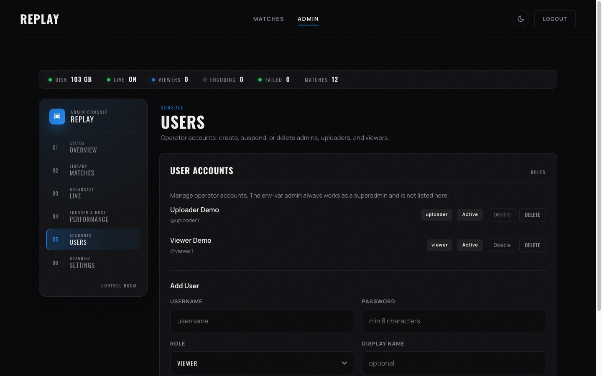

The page lists every account with role, status, and inline actions to **Disable** or **Delete**. The env-var superadmin does **not** appear here — it's outside the database.

### Creating a user

1. Scroll to the **Add User** form below the list.

   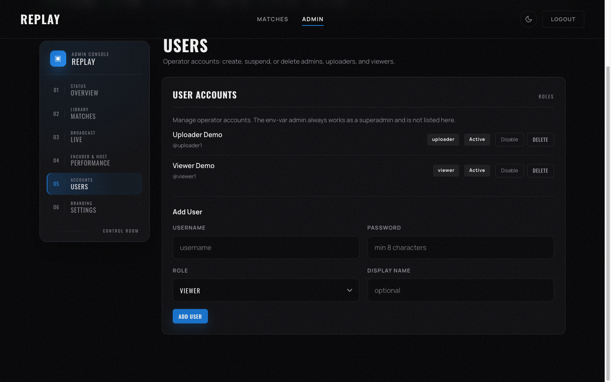

2. Fill in:
   - **Username** — 2–50 characters, letters/numbers/dots/hyphens only, case-insensitive uniqueness.
   - **Password** — at least 8 characters.
   - **Role** — `viewer`, `uploader`, or `admin` (see [Roles and access](#roles-and-access)).
   - **Display name** — optional. Shown in the header after sign-in.
3. Click **ADD USER**.

### Disabling vs deleting

- **Disable** flips the `enabled` flag to false. The account stays in the database; the user can't sign in until you re-enable it.
- **Delete** is permanent. Use this when someone leaves the team for good.

> **Tip:** Disable when in doubt. Deletion is irreversible and means re-creating the account from scratch if you change your mind.

### Resetting a password

Open the user's **⋯** menu and choose **Reset password**. Enter a new value and click save. There is no email-based reset flow — you set the password directly and pass it to the user.

---

## Branding and labels

The Settings page controls every customer-facing piece of copy and imagery.

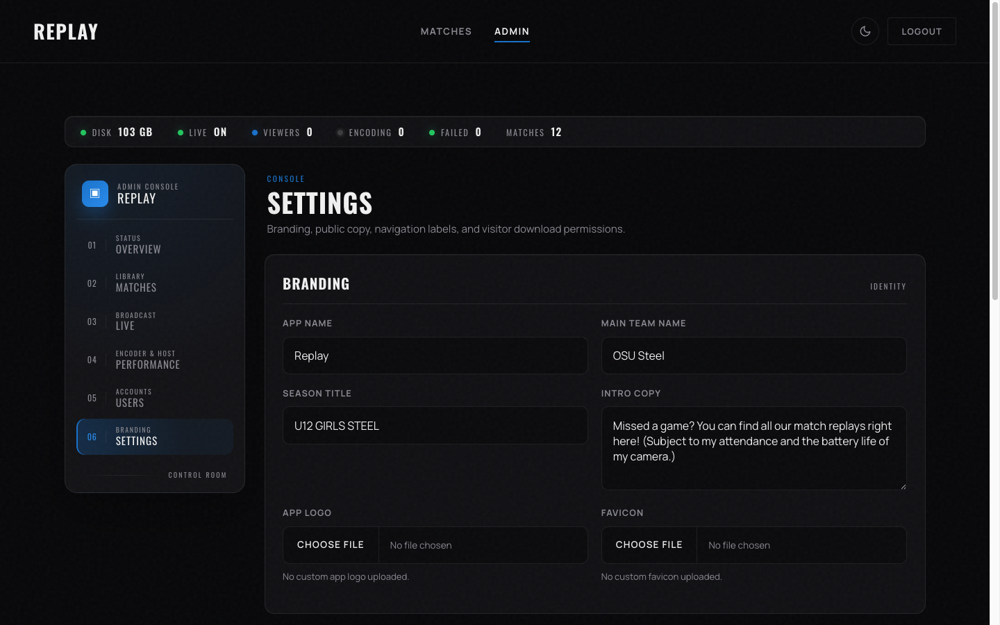

### Branding fields

| Field | Where it appears |
|---|---|
| **App Name** | Browser tab title and the top-left wordmark |
| **Main Team Name** | Used by the "vs." line on match cards (so the home club appears consistently) |
| **Season Title** | Big heading at the top of the home page |
| **Intro Copy** | Paragraph below the season title |
| **App Logo** | Top-left logo (replaces the "REPLAY" wordmark if uploaded) |
| **Favicon** | Browser tab icon |

> **Note:** Logos and favicons accept PNG, JPG, SVG, and WebP. SVG uploads have script tags stripped before serving — uploaded logos are still **inline** in the page, so a malicious SVG would otherwise be a stored XSS vector.

### Navigation and section labels

Scroll down to **Navigation & Season Labels** to rename every visible label.

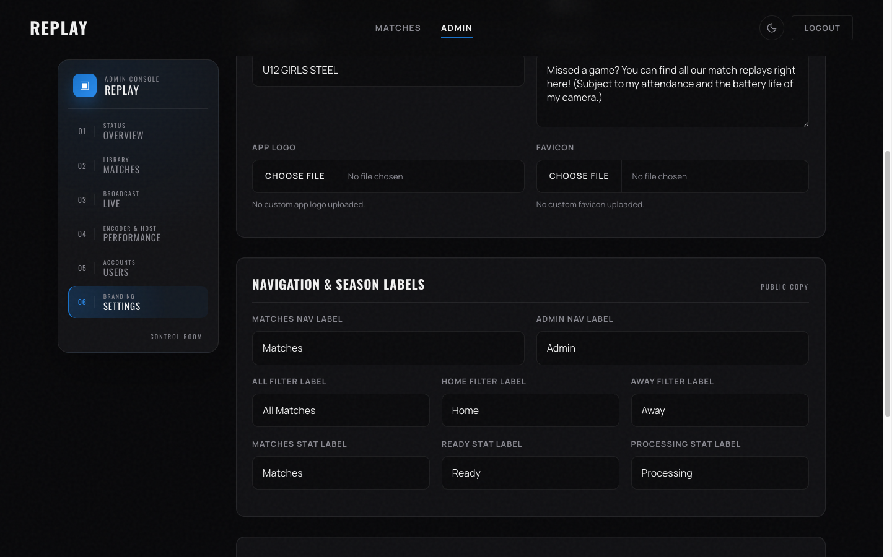

This is where you customize the words **Matches**, **Home**, **Away**, **Admin**, **Ready**, **Processing**, the filter buttons, and the team-stats button. If your league uses different terminology, you can adapt all of it without code changes.

### Feature toggles

The same page has checkboxes for:

- **Allow video downloads** — exposes a Download button on the player.
- **Enable Live Streaming** — shows or hides the **Watch Live** nav link site-wide.
- **Live offline message** — the text shown on `/live` when no stream is active.

---

## Backups and data export

Everything Replay knows about is in two places:

1. The SQLite database at `$REPLAY_DATA_DIR/replay.db`.
2. The video files under `$REPLAY_DATA_DIR/videos/` and `$REPLAY_DATA_DIR/app_assets/`.

### Database export

For a quick database snapshot, the admin endpoint `POST /api/admin/export-database` returns a `.db` file you can save. This is a hot backup — it uses SQLite's online backup API so the server keeps running.

For the full archive, copy the entire `$REPLAY_DATA_DIR` tree with any standard tool (`rsync`, Time Machine, ZFS snapshots, etc.) while the server is stopped or quiet.

> **Warning:** Don't `cp` the SQLite file while the server is under load — you'll get an inconsistent copy. Use the export endpoint or stop the server first.

### Restoring

To restore, stop the server, replace the data directory contents from your backup, and start the server again. Migrations are applied automatically on the next start.

---

## Reference

### Tunable settings (live, no restart)

These can be edited under **Performance → Tuning Knobs** and take effect immediately:

| Key | Type | Range |
|---|---|---|
| `transcode_concurrency` | int | 1–8 |
| `replay_hwaccel` | enum | auto / nvenc / vaapi / qsv / cpu |
| `min_free_disk_bytes` | int | 1 GB – 1 TB |
| `upload_disk_headroom_multiplier` | float | 1.0–5.0× |
| `stale_upload_session_seconds` | int | 600–604800 |
| `video_stream_chunk_bytes` | int | 64 KB – 8 MB |
| `upload_chunk_size_bytes` | int | 1 MB – 64 MB |
| `max_upload_size_bytes` | int | 1 GB – 64 GB |

### Tunable settings (new transcodes only)

These take effect for the **next** transcode; existing videos keep their old values until re-transcoded:

| Key | Type | Range |
|---|---|---|
| `hls_segment_duration` | int | 2–10 seconds |
| `hls_variant_presets` | JSON | Bitrate ladder |
| `live_hls_variant` | enum | mpegts / lowLatency |
| `live_record_enabled` | bool | 0/1 |
| `live_transcode_enabled` | bool | 0/1 |

### API endpoint summary

A short summary — for full details see the source in `server.py`.

| Endpoint | Purpose |
|---|---|
| `POST /api/login`, `POST /api/logout` | Authentication |
| `GET/POST/PUT/DELETE /api/matches` | Match CRUD |
| `POST /api/matches/{id}/upload-video/session` | Start resumable upload |
| `PUT /api/uploads/sessions/{id}/chunk` | Upload chunk |
| `POST /api/uploads/sessions/{id}/complete` | Finalize upload |
| `GET /api/admin/diagnostics` | System health |
| `GET /api/admin/performance` | Real-time metrics |
| `GET/PUT /api/admin/settings` | Application settings |
| `GET/POST/PATCH/DELETE /api/users` | User management |
| `POST /api/admin/live/rotate-key` | New stream key |
| `GET /api/admin/streams` | Active viewer sessions |

### Operator docs

For deployment and troubleshooting (Docker, Caddy, MediaMTX, Cloudflare, hardware acceleration), see:

- [`docs/DEPLOYMENT.md`](DEPLOYMENT.md)
- [`docs/TROUBLESHOOTING.md`](TROUBLESHOOTING.md)
