# Replay — Coaching Workspace Guide

This guide covers the coaching side of Replay end-to-end: the **`/coach` workspace** where coaches build the roster, write timestamped notes, draw on video with the telestrator, and assemble review playlists — and the **`/feedback` page** where players and families watch what's been shared with them.

For broader installation and admin operations, see the [administrator guide](./admin-guide.md). For end-user browsing and live viewing, see the [user guide](./user-guide.md).

## Contents

- [What the coaching workspace is](#what-the-coaching-workspace-is)
- [Getting started for coaches](#getting-started-for-coaches)
- [The roster](#the-roster)
- [Authoring coaching notes](#authoring-coaching-notes)
- [The telestrator](#the-telestrator)
- [Multi-player formation overlay](#multi-player-formation-overlay)
- [The Review tab](#the-review-tab)
- [Review playlists](#review-playlists)
- [Sharing with players and families](#sharing-with-players-and-families)
- [The player and family experience](#the-player-and-family-experience)
- [The focused feedback player](#the-focused-feedback-player)
- [On a phone](#on-a-phone)
- [Troubleshooting](#troubleshooting)

---

## What the coaching workspace is

Replay separates the two sides of the coaching loop:

- **`/coach`** is where coaches do the work — manage the roster, write notes against match moments, draw with the telestrator, build review playlists, and queue clips for the next session.
- **`/feedback`** (linked from the header as **My Feedback**) is what players and families see — the playlists and notes a coach has shared with them.

Both surfaces share the same focused video player and the same drawing renderer, so a coach can preview exactly what a family will see.

---

## Getting started for coaches

To use the coaching workspace you need a user account whose role grants the `coach` capability. The realistic combination is `coach,uploader` — a coach who also uploads match video. An admin grants this from the [Users tab](./admin-guide.md#users-and-roles).

Once you have the role, sign in from the header and a **COACH** link appears next to **MATCHES**. Click it to open `/coach`.

---

## The roster

The roster is independent of login accounts. A **roster player** records the athlete (display name, jersey number, active flag, internal notes). A **player ↔ user link** then connects one or more parent/guardian/family/player accounts to that roster entry. This separation supports common setups: two parents on one player, one account on two siblings, or an older player linked to their own account.

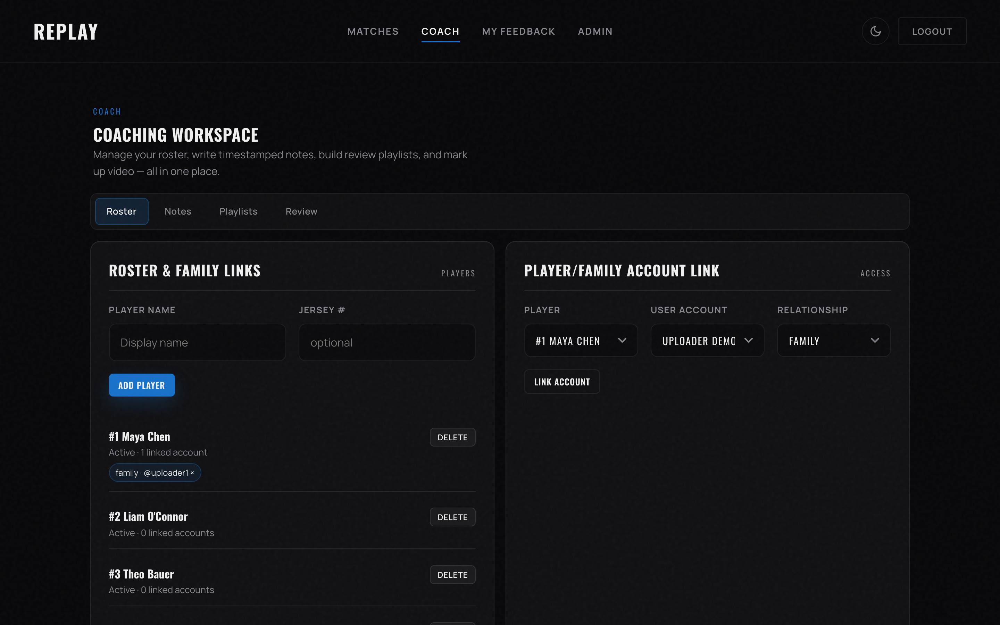

Add players with the inline form on the left card. Use the right card to link an existing user account to a roster player and pick the relationship (`parent`, `guardian`, `family`, or `self`). Toggle Active to hide a player from the active filter without deleting the record.

> **Tip:** Always create the roster *before* writing any individual-feedback notes. A note set to **Player/family** visibility is only seen by accounts that are linked to one of the note's selected players, so empty roster links mean no one will see the note.

---

## Authoring coaching notes

The Notes tab is list-first: every coaching note across every match in one scrollable view, grouped by match.

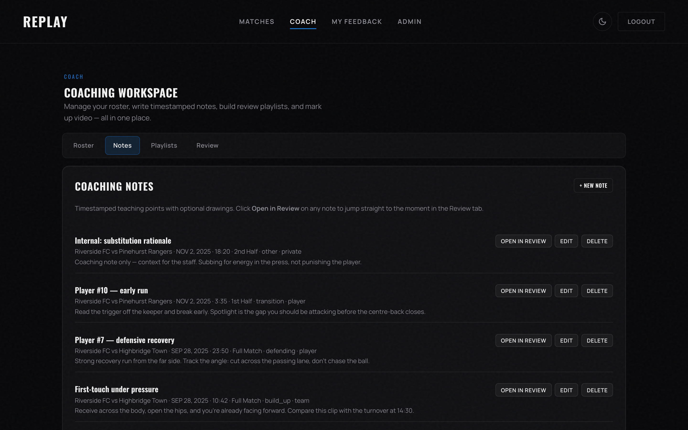

Click **+ New note** to author a note in a focused modal.

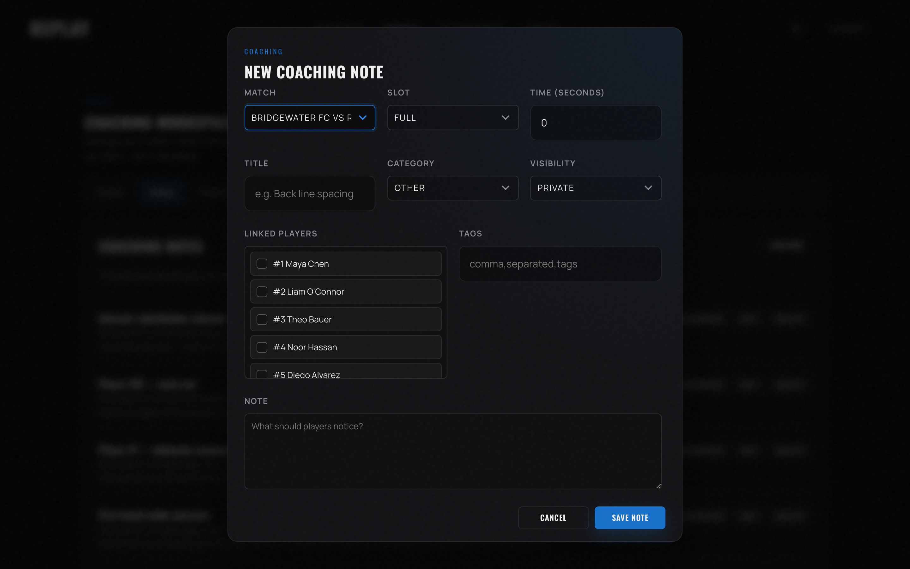

Each note has:

| Field | Purpose |
|---|---|
| **Match** | Which match the note belongs to. |
| **Slot** | `Full`, `1st Half`, or `2nd Half`. |
| **Time (seconds)** | The exact moment in the slot's timeline. |
| **Title** | One-line summary shown in lists. |
| **Category** | One of: shape, pressing, transition, set piece, build-up, finishing, defending, goalkeeper, effort, decision, other. |
| **Visibility** | Controls who sees it — see [the visibility table below](#sharing-with-players-and-families). |
| **Linked players** | Tags one or more roster players. Required for **Player/family** notes. |
| **Tags** | Free-form, comma-separated, for filtering and search. |
| **Note** | Free-text body, up to 4000 chars. |

Notes can also carry a **drawing overlay** painted with the telestrator — see the next section.

> **Note:** The Notes tab form is for the metadata. To paint a drawing on the video, use the **Review** tab instead.

---

## The telestrator

The telestrator is the drawing layer that paints over the paused match video. It lives in the Review tab.

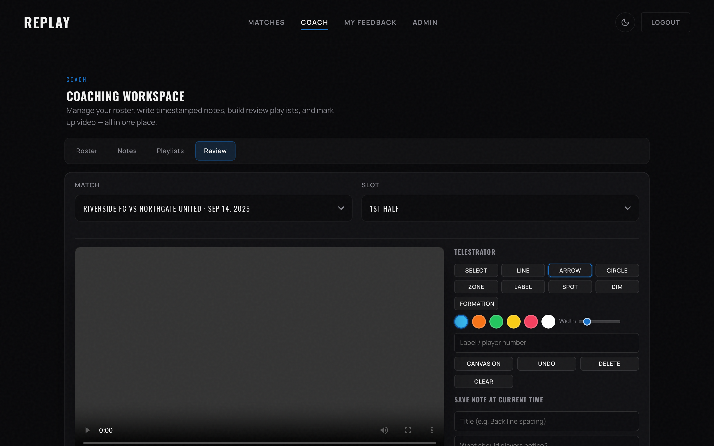

Eight drawing tools are available:

| Tool | Use it for |
|---|---|
| **Freehand** (`Line`) | Tracing a player's run or a passing pattern. |
| **Arrow** | Direction of a pass, run, or pressure trigger. |
| **Circle** | Marking a player or the ball. |
| **Zone** | A rectangular pitch area (defensive third, half-space, etc.). |
| **Label** | A short text caption pinned to a point. |
| **Spotlight** | A bright box that draws the eye and dims surrounding pixels. |
| **Dim** | A semi-transparent overlay across the whole frame; pair with Spotlight. |
| **Formation** | A multi-player polygon — see the next section. |

A color palette and width slider sit beneath the tool buttons. Use **Select** to pick an existing object and move or delete it. **Undo**, **Delete**, **Clear**, and **Canvas On/Off** sit at the bottom of the panel.

Drawings are saved as JSON metadata on the note — they are **not** burned into the video file. That means a player who later watches the same note in a different size, rotation, or device sees the drawing rendered crisply on top of the live frame, not baked into pixels.

---

## Multi-player formation overlay

The **Formation** tool is purpose-built for tactical shape: place 3–16 anchors on the pitch and Replay automatically computes the convex hull around them.

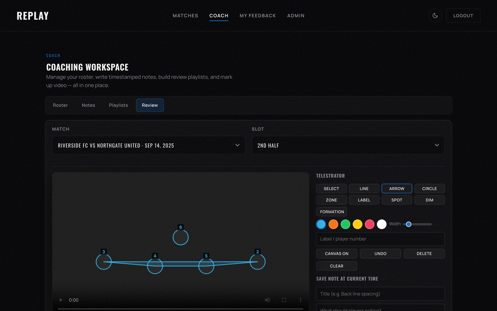

How it works:

1. Pick **Formation** from the toolbar. The Formation panel appears with a **Quick** / **Linked** mode toggle.
2. In **Quick** mode, click anywhere on the video to drop an anchor. In **Linked** mode, queue specific roster players first by clicking their jersey chips, then click on the video to bind each anchor to a queued player. The anchor labels show the jersey number automatically.
3. After three or more anchors, **Done** becomes available. Click it to finalize the polygon.
4. **Cancel** discards the in-progress anchors without saving.

Constraints worth knowing:

- A formation needs **at least 3 anchors and at most 16**.
- All anchors collinear? The hull would have zero area, so Replay refuses to save and shows a coach-readable error: *"Formation anchors are collinear — nudge one off the line so the hull has area."* Move one anchor off the line.
- Switching to a different drawing tool mid-draft discards the in-progress anchors. Re-select **Formation** to start over.

> **Tip:** Use **Linked** mode when the formation is meant to call out specific players (e.g., "back four during the Northgate spell"). Use **Quick** mode for a generic shape illustration.

---

## The Review tab

Review is the single authoring surface. Pick a match and slot at the top, and the side panel lists every existing note for that slot. The video player on the left is paired with the telestrator canvas; the right column is the telestrator panel and the **Save note at current time** form.

Two ways to land on Review:

- From within `/coach`, click the **Review** sub-tab and pick a match.
- From any match page, the header shows a **Coach this match in Review →** button (visible to users with the `coach` capability). Click it and Review opens deep-linked to that match and the slot you were watching.

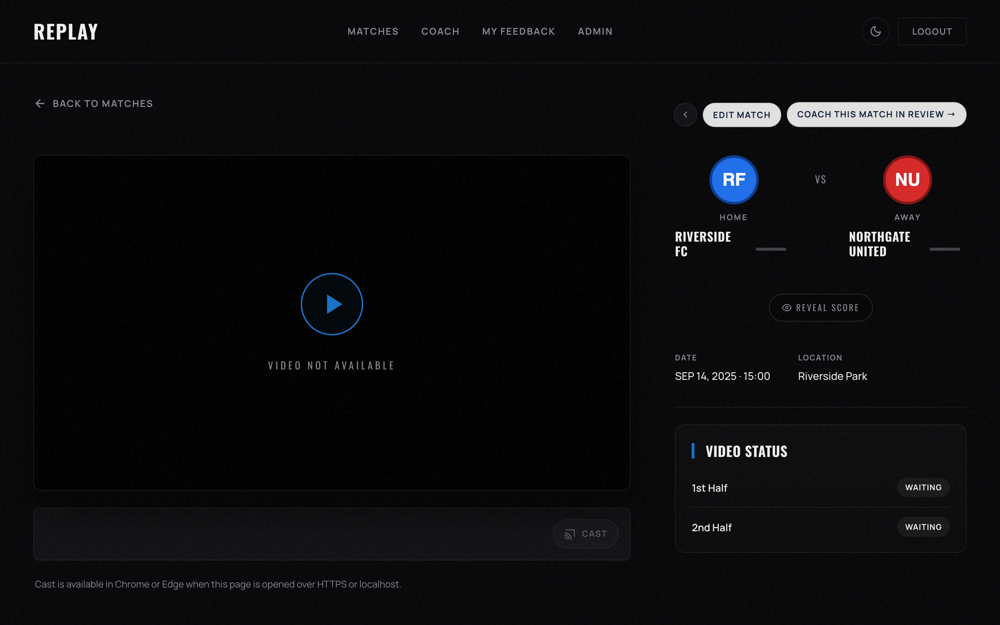

Workflow inside Review:

1. Scrub or seek to the moment you want to capture.
2. Pause the video.
3. Pick a tool and draw on the canvas.
4. Fill in the **Save note at current time** form (title, category, visibility, linked players, tags, body) and click **Save note**.

The Notes tab form (used by **+ New note** there) is a faster path when you don't need to draw — same fields, no canvas. Anything authored in Review still appears in the Notes tab list.

---

## Review playlists

Playlists group existing notes into a lesson such as "First-half pressing" or "Build-up decisions." Each playlist item references a note, plays it with optional pre-roll and post-roll, and auto-advances to the next item.

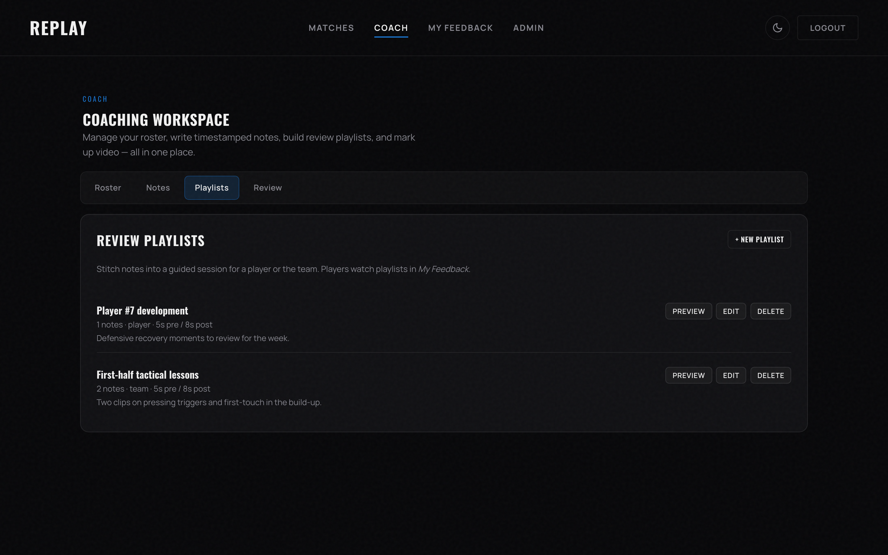

Click **+ New playlist** to author one.

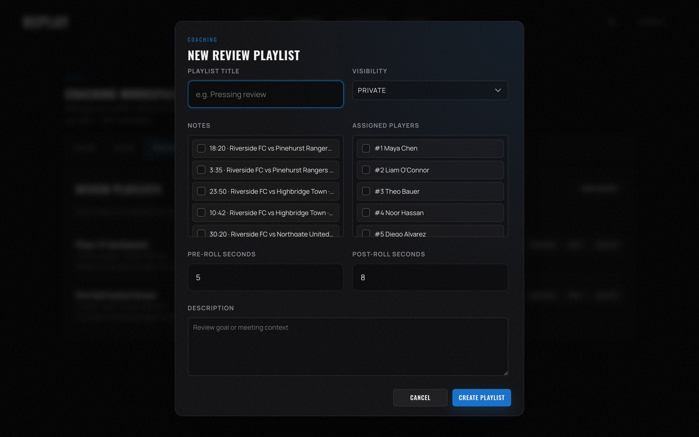

Playlist visibility uses the same matrix as notes (private / team / player/family / unlisted), with one important shortcut: **inside an active playlist session, every note in the playlist is playable** — even if some of those notes are private or hidden as standalone feedback cards. Visibility on the playlist itself controls who can start the session at all.

Pre-roll and post-roll seconds (default 5 / 8) extend the clip on either side of the saved timestamp so the player has context before and after the moment.

---

## Sharing with players and families

Visibility is the single most important field on every note and playlist. The matrix:

| Visibility | Who can see it |
|---|---|
| **Private** | Coaches and admins only. |
| **Team-visible** | Any signed-in user through **My Feedback**. |
| **Player/family** | Only signed-in users whose account is linked to one of the note's selected roster players. |
| **Unlisted link** | Signed-in users with the link-style access pattern. |

Combine the visibility setting with the **Linked players** field. A note marked Team-visible with no linked players is broadcast to the whole signed-in audience. A note marked Player/family with two linked players is shown only to the family accounts attached to those two roster entries.

---

## The player and family experience

When a player or family signs in, **My Feedback** appears in the header. It is the consumption side of the coaching loop.

The chip strip near the top lists the roster players linked to this account (`#7 Alex Park`, `#14 Riley Park`, etc.). The two sub-tabs are **Playlists** (default) and **Notes**.

Playlists are the natural starting point — coaches usually share work as a sequenced lesson rather than as loose notes.

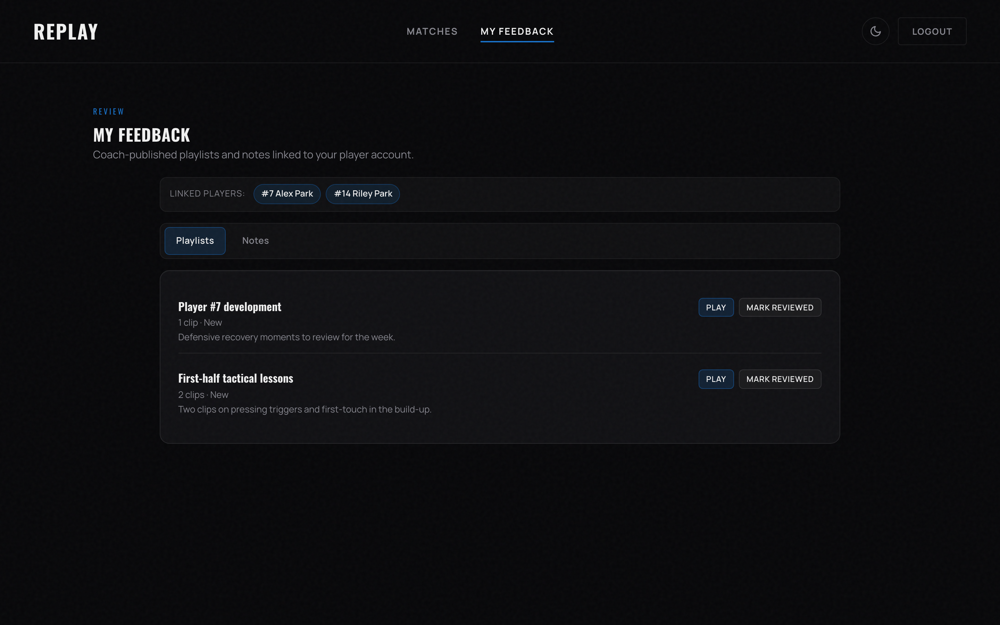

The **Notes** tab lists individual feedback that's been shared standalone, with category, timestamp, and the match it belongs to.

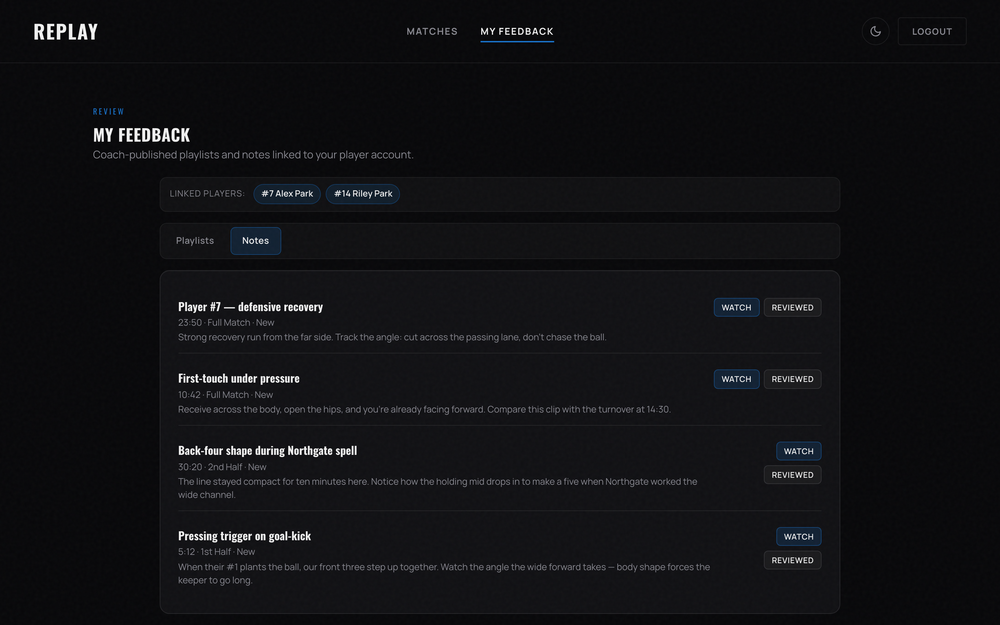

> **Note:** Private coach notes never appear here. The list reflects the visibility matrix exactly: team-visible notes plus player/family notes whose linked roster players match this account.

---

## The focused feedback player

Both **Play** (on a playlist) and **Watch** (on a note) open the same focused player modal. It owns the video and overlays the saved drawing on top. There's no navigation away to `/match/...` — playback stays in the modal, and the modal sends a 10-second heartbeat so admin "kill" actions still propagate.

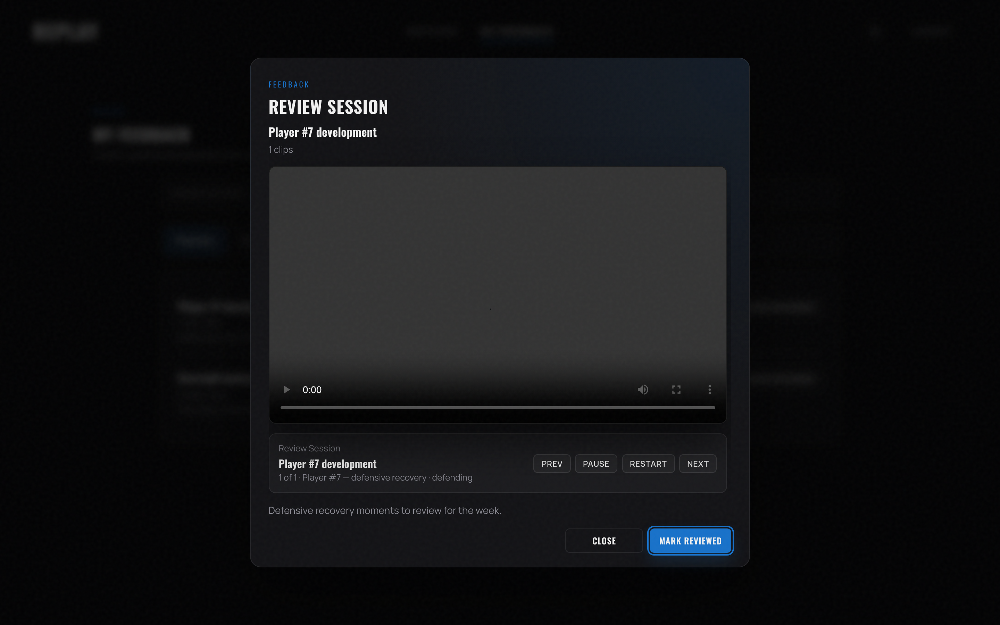

Inside the modal:

- **Prev / Pause / Restart / Next** navigates a playlist session.
- The drawing overlay (arrows, zones, formations, etc.) renders live on top of the paused video frame.
- **Mark reviewed** flags the note or playlist as watched for this account — this is what the coach sees in the dashboard.
- **Close** ends the session.

When opened from the Notes tab, the same modal switches to single-clip mode (no playlist controller).

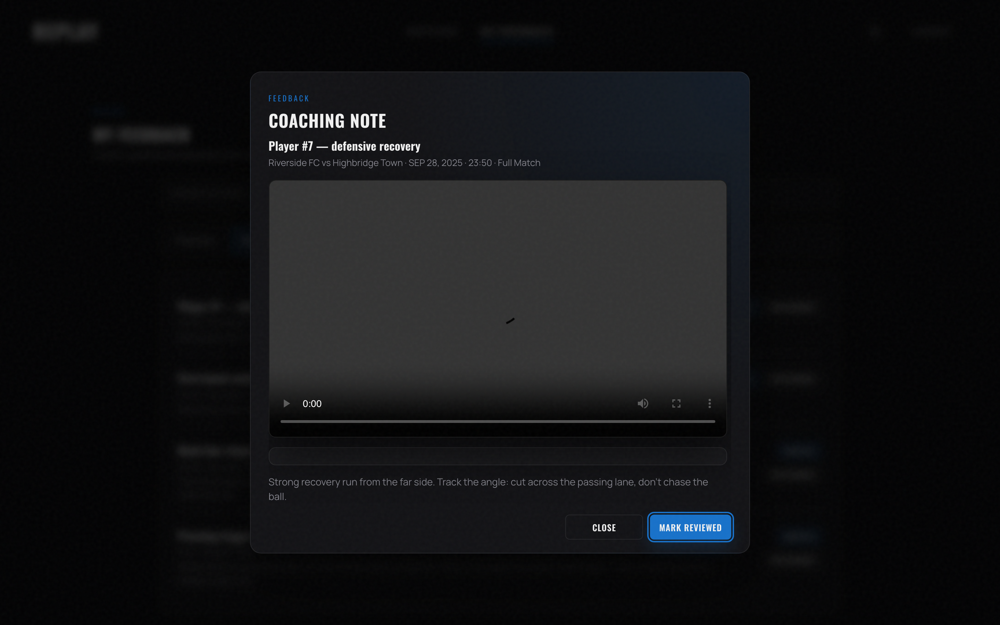

---

## On a phone

`/feedback` is fully usable on a small screen. Tabs collapse to the top, playlist and note rows stack vertically, and the focused player resizes to the viewport.

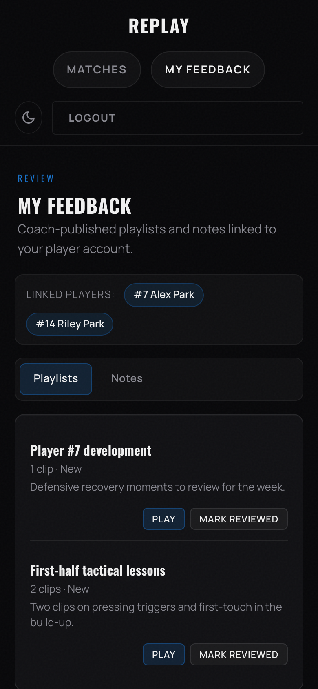

---

## Troubleshooting

**The COACH link doesn't show up in the header**
Your account does not have the `coach` capability. Ask an admin to update your role to include `coach` (the realistic combo is `coach,uploader`). See the admin guide's [Users and roles section](./admin-guide.md#users-and-roles).

**A formation won't save: "needs at least 3 anchor points"**
Drop more anchors on the video before clicking **Done**. Three is the minimum; sixteen is the maximum.

**A formation won't save: "anchors are collinear"**
Every anchor sits on a straight line, so the convex hull would have zero area. Nudge one anchor away from that line and try again.

**A family says they can't see a note I sent them**
Check three things in order: (1) the note's **Visibility** is Player/family or Team-visible (not Private/Unlisted); (2) the **Linked players** include the right roster entries; (3) on the Roster tab, the family's user account is linked to those roster players with a relationship like `parent`, `guardian`, or `family`.

**The drawing didn't save when I clicked Save note**
The save call is a network round-trip; if the response failed you'll see a toast. Check the browser dev-tools network tab for a non-200 response from `/api/coach/notes`. The most common cause is a missing **Title** (required) or a corrupted drawing payload (over 50 KB or with too many points).

**The video is empty inside the focused feedback player**
The match has no uploaded slot for the timestamp the note targets. Have an uploader add the video on the [Matches tab](./admin-guide.md#managing-matches) — the same note will play back with audio and video once the slot is available.
