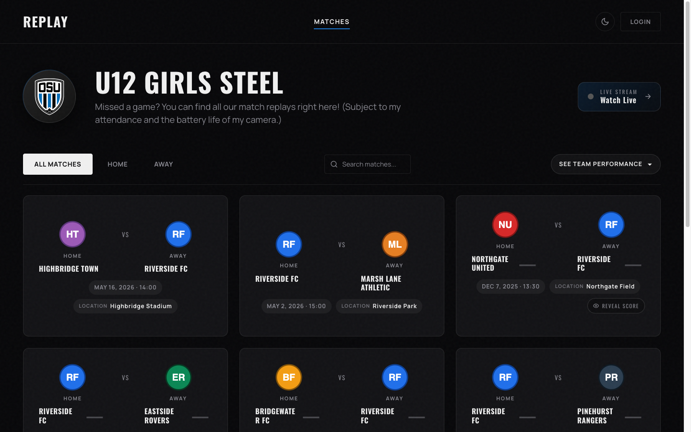
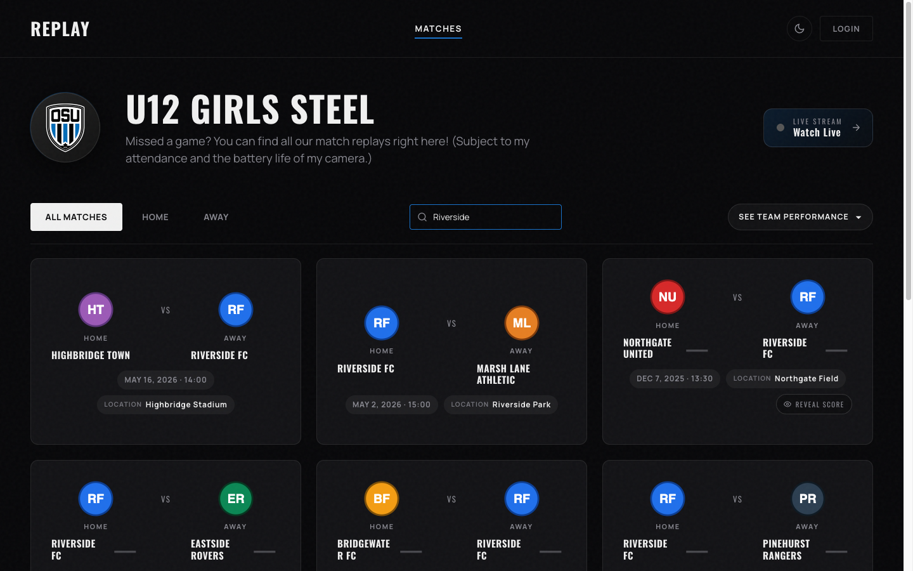
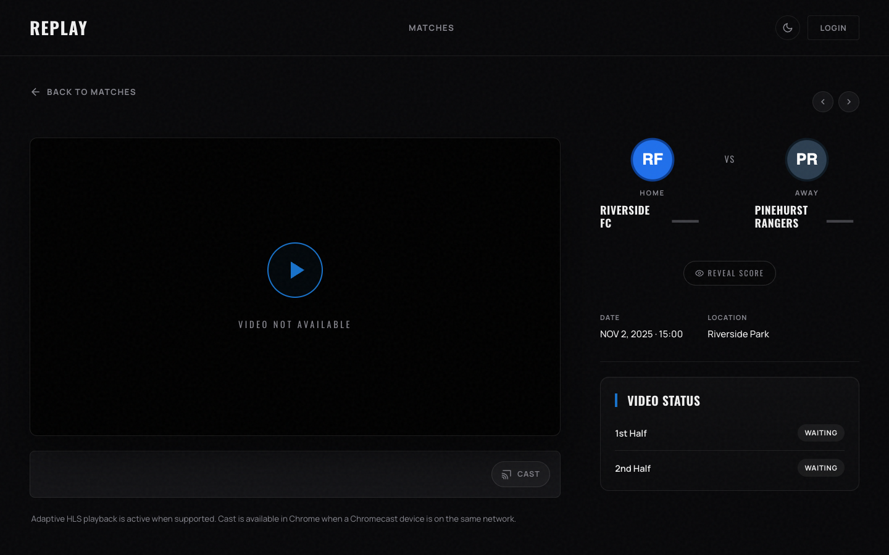
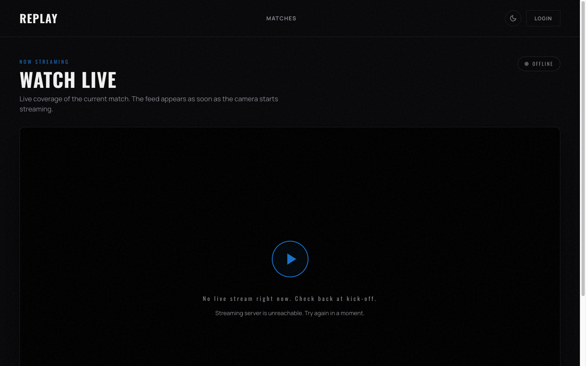
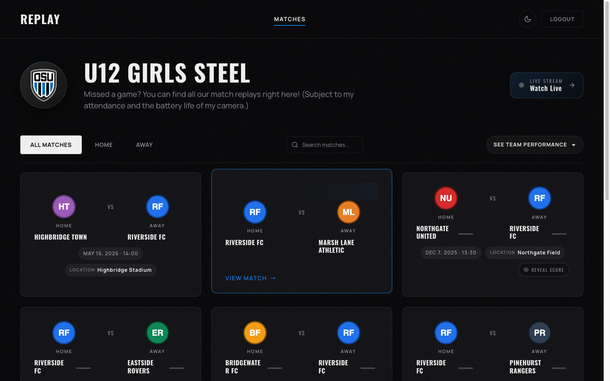
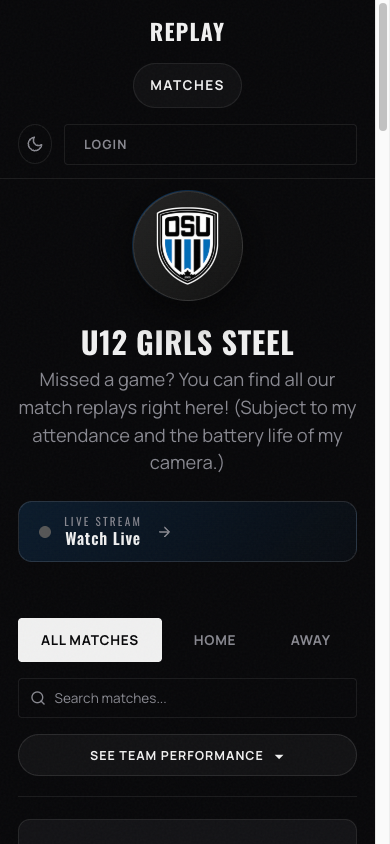

# Replay — User Guide

Welcome to **Replay**, your team's match video archive. This guide walks you through everything you can do as a viewer: browsing the season, watching recorded matches, watching live, and signing in.

## Contents

1. [What Replay is](#what-replay-is)
2. [Browsing the season grid](#browsing-the-season-grid)
3. [Searching and filtering](#searching-and-filtering)
4. [Watching a match](#watching-a-match)
5. [Watching live](#watching-live)
6. [Signing in](#signing-in)
7. [On a phone or tablet](#on-a-phone-or-tablet)
8. [Troubleshooting](#troubleshooting)

---

## What Replay is

Replay is a private video library for your team's matches. Coaches and team admins upload match footage; players, parents, and supporters can watch recordings any time. When the team is playing live, the same site streams the game so anyone with the link can watch from home.

You don't need an account to watch — most pages are open to anyone with the link.

---

## Browsing the season grid

The home page shows all matches for the current season as a grid of cards. Each card shows the two teams, the date, and a logo for both clubs.

> **Note:** Final scores are hidden by default so you can watch the replay first without spoilers. Click the small chip with the eye icon on a card if you want to see the result before watching.

---

## Searching and filtering

Use the controls above the match grid to narrow the list:

- **All Matches / Home / Away** — show every match, only home games, or only away games.
- **Search box** — type a team name, location, or date and the grid filters as you type.
- **See Team Performance** — opens a quick stats summary for the season.

> **Tip:** The search is forgiving. Typing part of a team name is enough — you don't have to match it exactly.

---

## Watching a match

1. Click any match card on the home page.
2. The match detail page opens with the player on the left and match information on the right.

3. Press the **play** button on the video.
4. Use the segment toggle below the player to switch between **Full Match**, **First Half**, and **Second Half** if the match was recorded as two halves.

> **Note:** A match may show **"Video not available"** if the recording hasn't been uploaded yet, or if it is still being processed. Check back later — match cards on the home page will show a status indicator once a video is ready.

### Player shortcuts

While the video has focus, these keys work like a YouTube player:

| Key | Action |
|---|---|
| Space | Play / pause |
| ← / → | Skip back / forward 5 seconds |
| ↑ / ↓ | Volume up / down |
| F | Toggle fullscreen |
| M | Mute / unmute |
| 0–9 | Jump to 0%–90% of the video |
| < / > | Slow down / speed up playback |

### AirPlay & Chromecast

The player shows AirPlay and Chromecast buttons next to the volume control when a compatible device is on your network. Tap one to send the video to your TV.

---

## Watching live

When the team is playing right now, click **Watch Live** in the top-right of the home page (or open `/live` directly). The page shows the camera feed with a small **LIVE** badge in the top-right.

If no stream is currently broadcasting, the page shows the message above and a play button that does nothing — that's expected. Refresh the page once the team confirms the camera is rolling.

> **Tip:** AirPlay and Chromecast also work for the live feed. Cast it to your TV and watch with friends.

---

## Signing in

Most of Replay is open to anyone, but some teams enable login for additional features. Click the **LOGIN** button in the top-right.

Enter the username and password your coach or team admin gave you and click **LOGIN**.

Once signed in, the LOGIN button is replaced by **LOGOUT** and your name appears in the header.

> **Warning:** Replay locks out an IP after 5 failed login attempts in 60 seconds. If you mistype your password a few times, wait a minute before trying again.

---

## On a phone or tablet

The site is fully usable on a small screen. Match cards stack vertically, the search and filter buttons sit above the list, and the video player resizes to fit.

> **Tip:** On iOS, AirPlay also works straight from the in-page player — tap the AirPlay button next to the volume control.

---

## Troubleshooting

**The video won't autoplay.**
Most browsers block autoplay for videos with sound. Tap the play button once and the video starts.

**The video starts buffering or stuttering.**
Replay automatically picks the best quality for your connection. If your network slows down, drop to a lower quality manually using the gear icon on the player. Refreshing the page often helps too.

**I can't sign in even though I'm sure my password is right.**
Wait one minute — repeated failures temporarily block your IP from logging in. If you still can't get in, ask your team admin to reset your password.

**The Watch Live page says "no live stream."**
The camera isn't broadcasting yet. Refresh the page once the team starts the stream — the page does not auto-update when a stream starts.

**My score reveal disappeared after refreshing.**
That's by design. Reveal state is per-session, so once you reload the page, scores are hidden again.

**Something else.**
Ask your team admin — they can check the server-side logs to see what's going on.
